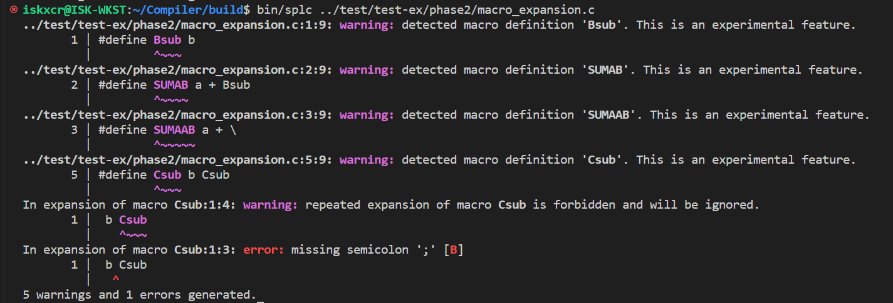

# CS323-Compiler-Project

## TODO
- C Preprocessor
  - Macro variable/function substitution
  - Recursive macro expansion
    - *(Done) Recursive file inclusion*
- Main structure
  - **SPL Grammar**:
    - **Parser**:
      - *(Done) Pointer/Address-Of Support*
      - *(Done) Support All C operators*
      - *(Done) Support type-qualifiers*
  - LUT (Look-Up Table)
      - *(Experimental) Done*
  - AST
    - *(Done) Mark the source of function precisely*
  - Utilities
    - `util_file_node`
      - *(Done) Support file node ID*
      - *(Done) Reference file node from AST through ID*
      - *(Done) Rewrite auto-recycling*:
        - *(Done) Keep track of file ID and filename*

## Phase 1

### Extended Feature List
- Error Detection:
  - Hanging else
  
  - Invalid function definition inside functions
  
  - Various errors about missing parenthesis/square bracket
  
  - Various errors about missing operands:
  
    
  
  - Errors about invalid constant form
  
    
  
    
  
- Features:
  - Optimized error/warning output
  
    
  
    **This may cause the `diff`** **utility not to work when batch verifying**, as ASCII control sequences are used to color the output and they will not be recognized by `diff`.
  
    The parsing tree will not be colored.
  
  - Allowing unary operators: +/-
  
  - Allowing unary prefix/postfix operator: ++/--
  
  - Allowing for loop declaration
  
    - Allow any type of for loop combination:
  
      ```c
      for ([optional definition]; [optional expression]; optional expression)
          stmt
      ```
  
    - Run parser on `test_ex/test_6.spl` for details.
  
  - Allowing the following floating-point declaration, given by `[0-9]*\.[0-9]+([eE][-+]?[0-9]+)?`:
  
    ```c
    float y = .3e-13;
    ```
  
  - Allow single-line/cross-line comments
  
    ```c
    int main()
    {
        int a = 0; // This is a single comment.
        int b = 0; // This is a cross-line comment \
                      as you can tell by changing the language server interpreting this comment to match the C language.
        int c = 233; // Hi! C
        /*
        This is a cross-line comment.
        */
        int d = c;
        /* Hi!
        */
       
        */ // This is a hanging comment, which should not be recognized
    }
    ```
  
    
  
  - Allow single-line/cross-line strings:
  
    - Allowed escape characters: `\[abefnrtv\'"?]`
  
    ```c
    
    int main()
    {
        char msg1 = "Hi Just want to test!";
    
        char msg2 = "Hi \
                        Just want to test!";
    
        char msg3 = "Hi"
                    "Thanks!";
        printf("[%s]", msg);
        return 0;
    }
    ```
  
    
  
    
